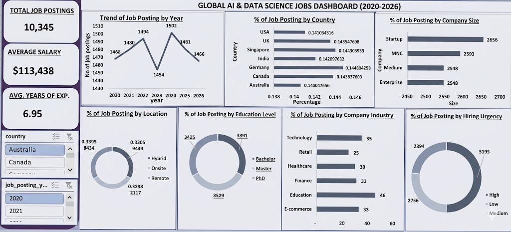

# GLOBAL AI AND DATA SCIENCE JOBS ANALYSIS 2020-2026

## INTRODUCTION
As artificial intelligence and data-driven decisions have been a top priority for international bodies, the demand for specialized talent has fluctuated a great deal. This project gives a comprehensive analysis of the global market for Artificial Intelligence and Data Science professionals over a seven-year period. The dashboard presented identifies key trends in hiring, salary benchmarks, and the evolving requirements of the industry to aid recruiters ands job seekers in the tech sector.

## ABOUT THE DATASET
This dataset contains a total of 10,345 job postings recorded between 2020 and 2026 with data according to company size, years of experience, job title, location type, country, experience level, company industry etc. Also, high-level key performance indicators are total job postings, average salary, and average experience. There are several dips, recoveries and growths in the trend of job postings by year, geographical and company demographics which includes country distribution, company size, job requirements (education level) and work environment (hybrid, onsite and remote). Industry focus showcases top industries like education, technology, commerce, retail and healthcare with hiring urgencies ranging from high, medium to low.

## PROBLEM STATEMENT
Despite the increasing reach of the AI sector, job seekers are often at a loss when considering factors like academic qualifications required, companies that are currently hiring, the company sizes and types which impacts their employment. This project aims to close the information gap by visualizing critical factors.

Microsoft excel was used to design and develop this interactive dashboard for analyzing trends.

## INSIGHTS
**Company Type Dynamics**: Startups lead the most postings (2,656), slightly outpacing MNCs (Multi-National Corporations). This indicates steady growth.

**Urgency Levels**: 5,195 postings are categorized as MEDIUM hiring urgency, with LOW urgency following. This suggests a more calculated and thorough recruitment process in the sectors. 

**Education Trends**: There is a balanced distribution among education levels, though Masters and Bachelor’s degrees show nearly equal distribution in job requirements, highlighting that a specialized degree is highly valued.

**Competitive Salary**: The average salary which is $113,438 reflects the high-value nature of these technical roles.

**Job Stability**: The mount of job postings remained stable with a brief peak in 2024 with 1,502 postings, indicating consistency in demand for AI skills.

## RECOMMENDATIONS
Junior professionals should focus on building versatile portfolios to bridge the mid-level gap.
Professionals should target their applications to countries such as Germany and the UK due to the strong distribution of prospects.

## CONCLUSION
The AI and Data Science job market is quite a competitive one with envious salary and demonstrates resilience and consistency in both job demands and skills use. While the volume of jobs is high, the barrier to entry is high as well due to education specialty requirement. 

